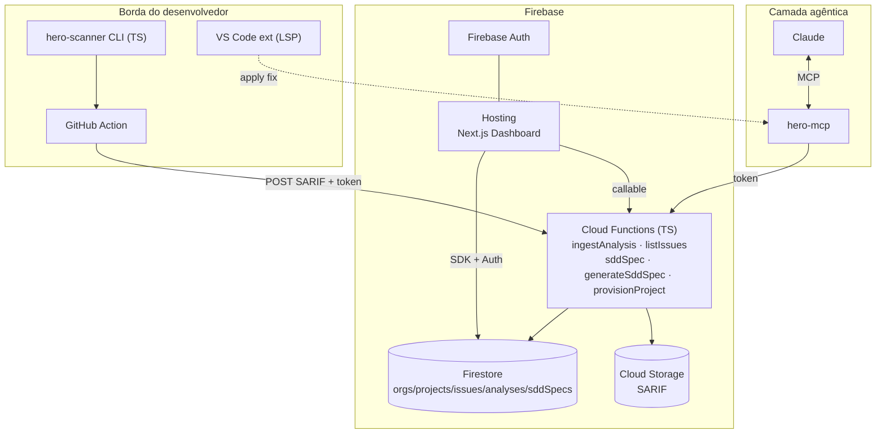

# CodeHero — Arquitetura (SaaS no Firebase)

Adaptação do plano original (Rust/Go/Postgres/ClickHouse) para um **SaaS nativo em Firebase**, mantendo os três módulos e o princípio central: **a IA nunca está no caminho crítico da inspeção**.

## Princípio invariável

- **Inspeção** = determinística, na borda (CLI/CI/IDE), sem chamada de LLM por arquivo.
- **IA** = offline (compila regras — `hero-ruleforge`) e assíncrona/sob demanda (gera specs SDD — `hero-forge`).
- **Contrato** entre os dois mundos = **SARIF-estendido** (detecção) → **SDD Spec** (correção verificável).

## Mapeamento de containers: plano original → Firebase

| Papel | Plano original | **Adaptação Firebase** |
|---|---|---|
| Motor de inspeção | Rust + tree-sitter | **TS/Node** na borda (MVP) → Rust (V1+). Roda em CLI/CI/IDE, nunca no servidor |
| API/Gateway | Go | **Cloud Functions (2ª gen, TS)** — `ingestAnalysis`, `listIssues`, `sddSpec` |
| Workers | Go | Cloud Functions acionadas por HTTP/Firestore triggers |
| SDD/IA | Python/FastAPI | **Callable Function** `generateSddSpec` (+ `hero-forge` opcional em Cloud Run p/ LLM) |
| Dashboard | Next.js | **Next.js no Firebase Hosting** |
| Metadados | PostgreSQL | **Firestore** (`orgs/projects/issues/analyses/sddSpecs`) |
| Séries temporais | ClickHouse | Firestore (MVP) → **BigQuery** export (Scale-up) |
| SARIF/artefatos | S3 | **Cloud Storage** |
| Event bus | NATS/Kafka | **Firestore triggers / Pub/Sub** (Eventarc) |
| Auth/Multi-tenant | custom | **Firebase Auth** + modelo `orgs/{orgId}/members` |
| MCP server | TS | `@codehero/mcp` (stdio), proxy dos endpoints token-guarded |

## Diagrama de containers (Firebase)



## Modelo de dados no Firestore

```
orgs/{orgId}
  ├─ name, ownerUid, createdAt
  ├─ members/{uid}                     → { role: owner|admin|member }
  └─ projects/{projectId}
       ├─ name, repoUrl, mainBranch, ingestToken (secret)
       ├─ debtMinutes, maintainabilityRating, securityRating, qualityGateStatus
       ├─ analyses/{analysisId}        → { branch, commit, summary{bySeverity,debt,gate}, sarifPath }
       ├─ issues/{fingerprint}         → { ruleId, severity, file, line, snippet, status, isNewCode, ... }
       └─ sddSpecs/{specId}            → SDD Spec + createdBy
```

**Segurança:** toda escrita de análise/issue passa por Functions (Admin SDK). As regras do Firestore são *read-mostly*, restritas por `members/{uid}`. O `ingestToken` autentica o CI (bearer). Ver `firestore.rules`.

## Fluxo de correção (loop verificável)

1. `hero-scanner` gera SARIF na borda → `ingestAnalysis` persiste issues + débito + quality gate.
2. Dev/Claude pede correção → `sddSpec`/`generateSddSpec` monta o **SDD Spec** (com `acceptanceCriteria` verificáveis) a partir da issue + template.
3. Claude (via `hero-mcp`) gera `unified_diff`, aplica, roda `run_scan` e checa **AC1** (issue resolvida) objetivamente.
4. Telemetria do fix realimenta o dataset do `hero-ruleforge` (Scale-up).

## Fórmulas (SQALE) — implementadas em `@codehero/contracts/metrics`

- `TechnicalDebt = Σ remediationEffortMin` (code smells)
- `DevelopmentCost = LOC × 30min`
- `TDR = Debt / DevelopmentCost` → Maintainability Rating A–E
- Security/Reliability Rating = pior severidade presente
- Quality Gate sobre **new code** (coverage, duplicação, blockers, ratings)

## Roadmap (Firebase)

| Fase | Entregáveis | Status |
|---|---|---|
| **0 — Fundação** | Monorepo, contratos (SARIF+/SDD/SQALE), Firebase config, regras | ✅ feito |
| **1 — MVP** | Scanner→SARIF, `ingestAnalysis`, débito/quality gate, GitHub Action, dashboard read-only | ✅ scanner+functions+action / 🟡 dashboard |
| **2 — V1** | `generateSddSpec` + `hero-mcp` + loop agêntico, VS Code LSP, ruleforge v0, +linguagens | 🟡 SDD+MCP feitos / ⬜ IDE, ruleforge |
| **3 — Scale-up** | BigQuery, taint inter-procedural (Rust), RBAC/SSO, feedback loop, auto-regras via CVE | ⬜ |

## Dependências críticas

1. **Contratos congelados** (SARIF+/SDD Spec) — feito, base de tudo.
2. **Scanner re-executável programaticamente** (`run_scan`) — feito, habilita a verificação agêntica.
3. **Corpus golden** para validar regras geradas por IA — pendente (bloqueia `hero-ruleforge`).
