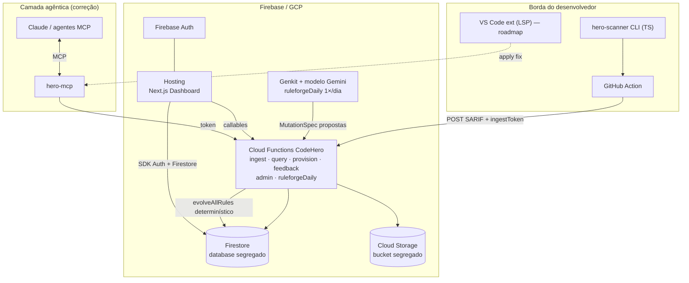
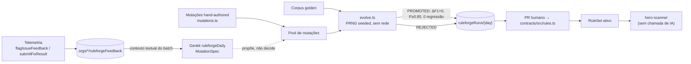

# CodeHero — Arquitetura (SaaS no Firebase)

Adaptação do plano original (Rust/Go/Postgres/ClickHouse) para um **SaaS nativo em Firebase**, mantendo os três módulos e o princípio central: **a IA nunca está no caminho crítico da inspeção**.

Quando o CodeHero compartilha um projeto GCP/Firebase com outros apps, os recursos são **segregados** (banco Firestore nomeado, bucket próprio, site de Hosting e Functions com nomes distintos) — ver [Segregação de recursos](#segregação-de-recursos).

## Princípio invariável

- **Inspeção** = determinística, na borda (CLI/CI/IDE), sem chamada de LLM por arquivo.
- **IA** = offline e em lote:
  - **propõe** mutações de regra via Genkit (`ruleforgeDaily`, 1×/dia);
  - **nunca decide** promoção — o corpus golden + `evolve.ts` decidem;
  - sob demanda, monta specs SDD (`generateSddSpec` / templates; LLM opcional no futuro).
- **Contrato** entre os dois mundos = **SARIF-estendido** (detecção) → **SDD Spec** (correção verificável).

## Mapeamento de containers: plano original → Firebase

| Papel | Plano original | **Adaptação Firebase** |
|---|---|---|
| Motor de inspeção | Rust + tree-sitter | **TS/Node** na borda (MVP) → Rust (V1+). Roda em CLI/CI/IDE, nunca no servidor |
| API/Gateway | Go | **Cloud Functions (2ª gen, TS)** — `ingestAnalysis`, `listIssues`, `sddSpec`, … |
| Workers / cron | Go + scheduler | **`onSchedule`** — `ruleforgeDaily` (Genkit); demais HTTP/callable |
| SDD / correção | Python/FastAPI | Callable `generateSddSpec` + HTTP `sddSpec` (templates; LLM fora do scan) |
| Evolução de regras | — | **`@codehero/ruleforge`** + Genkit flow diário (propõe) → gate determinístico (decide) |
| Dashboard | Next.js | **Next.js** no Firebase Hosting (AuthGate + Firestore do CodeHero) |
| Metadados | PostgreSQL | **Firestore** (database nomeado do CodeHero) |
| Séries temporais | ClickHouse | Firestore (MVP) → **BigQuery** export (Scale-up) |
| SARIF / artefatos | S3 | **Cloud Storage** (bucket dedicado do CodeHero) |
| Event bus | NATS/Kafka | Firestore triggers / Pub/Sub (Eventarc) — Scale-up |
| Auth / multi-tenant | custom | **Firebase Auth** + `orgs/{orgId}/members` + `platformAdmins` |
| MCP server | TS | `@codehero/mcp` (stdio), proxy dos endpoints token-guarded |

## Diagrama de containers (Firebase)



## Segregação de recursos

Em projeto GCP compartilhado com outros produtos, o CodeHero **não** reutiliza o mesmo banco Firestore nem o mesmo bucket de Storage dos demais apps. Auth permanece no nível do projeto (limitação do Firebase).

| Recurso | Isolamento |
|---|---|
| Hosting | site dedicado ao CodeHero |
| Cloud Functions | exports com nomes próprios (sem colisão com outros codebases) |
| Firestore | **database nomeado** exclusivo do CodeHero |
| Storage | **bucket** exclusivo do CodeHero |
| Auth | compartilhado no projeto; authorized domains do site CodeHero |

IDs concretos (project, database, bucket, site) vivem só em configuração local / CI — ver `packages/contracts` (`CODEHERO_FIREBASE`) e `apps/web/.env.local.example`. Não são documentados aqui.

| Artefato | Papel |
|---|---|
| `.firebaserc` / `firebase.json` | apontam site, database e bucket do CodeHero |
| Functions Admin SDK | `getFirestore(<db CodeHero>)` + bucket dedicado |
| Web client | `getFirestore(app, <db CodeHero>)` via env |
| Deploy | publica apenas hosting/functions/rules/indexes/storage do CodeHero |

Credenciais e secrets (API keys, service account, chave do modelo) ficam em Secret Manager / variáveis de ambiente / secrets do CI — nunca neste documento.

## Modelo de dados (Firestore do CodeHero)

```
platformAdmins/{uid}                 → grant out-of-band (scripts/seed-admin.mjs)
ruleforgeRuns/{yyyy-mm-dd}           → relatório Genkit diário (promoted/rejected + patterns)

orgs/{orgId}
  ├─ name, ownerUid, createdAt
  ├─ members/{uid}                   → { role: owner|admin|member }
  ├─ ruleforgeFeedback/{id}          → telemetria FP/confirmed (humano)
  └─ projects/{projectId}
       ├─ name, repoUrl, mainBranch, ingestToken
       ├─ debtMinutes, maintainabilityRating, securityRating, qualityGateStatus, openIssues
       ├─ analyses/{analysisId}      → { branch, commit, summary, sarifPath }
       ├─ issues/{fingerprint}       → { ruleId, severity, file, line, snippet, status, … }
       └─ sddSpecs/{specId}          → SDD Spec + createdBy
```

**Storage:** `orgs/{orgId}/projects/{projectId}/analyses/{analysisId}.sarif.json` — só Admin SDK (rules deny client).

**Segurança:** escritas de análise/issue/provisionamento só via Functions (Admin SDK). Cliente: *read-mostly* por `isOrgMember` / `isPlatformAdmin`. CI autentica com `ingestToken` (bearer). Ver `firestore.rules` e `storage.rules`.

## Cloud Functions (inventário)

| Export | Tipo | Papel |
|---|---|---|
| `ingestAnalysis` | HTTP | CI → SARIF + métricas SQALE + quality gate (`BulkWriter`) |
| `listIssues` / `sddSpec` | HTTP | MCP/CI com bearer `ingestToken` |
| `generateSddSpec` | callable | Auth + membership → SDD Spec |
| `provisionProject` | callable | cria org + member + projeto + `ingestToken` (mostrado 1×) |
| `flagIssueFeedback` / `submitFixResult` | callable / HTTP | telemetria humana / agente |
| `checkPlatformAdmin` / `adminListAllProjects` | callable | visão global (só `platformAdmins`) |
| `ruleforgeDaily` | **schedule** diário | Genkit propõe → evolve determinístico → `ruleforgeRuns` |
| `runRuleforgeDaily` | callable | disparo manual (platform admin) |

## Dashboard (`apps/web`)

- **AuthGate:** email/senha + Google (Firebase Auth).
- Após login: lista projetos via `collectionGroup("projects")` (rules por membership).
- **Novo projeto:** callable `provisionProject`; exibe `ingestToken` uma vez.
- Platform admin: `adminListAllProjects` (cross-org).
- Configuração local: copiar `apps/web/.env.local.example` → `.env.local` (valores não versionados).

## Fluxo de correção (loop verificável)

1. `hero-scanner` gera SARIF na borda → `ingestAnalysis` persiste issues + débito + quality gate (+ SARIF no bucket CodeHero).
2. Dev/agente pede correção → `sddSpec` / `generateSddSpec` monta o **SDD Spec** (`acceptanceCriteria` verificáveis).
3. Agente (via `hero-mcp`) gera `unified_diff`, aplica, roda `run_scan` e checa **AC1** (issue resolvida) objetivamente.
4. `submitFixResult` / `flagIssueFeedback` realimentam telemetria; o job Genkit diário usa gaps do corpus (+ feedback) só como **contexto de proposta**.

## Fórmulas (SQALE) — `@codehero/contracts/metrics`

- `TechnicalDebt = Σ remediationEffortMin` (code smells)
- `DevelopmentCost = LOC × 30min`
- `TDR = Debt / DevelopmentCost` → Maintainability Rating A–E
- Security/Reliability Rating = pior severidade presente
- Quality Gate sobre **new code** (blockers, ratings, …)

## Roadmap (Firebase)

| Fase | Entregáveis | Status |
|---|---|---|
| **0 — Fundação** | Monorepo, contratos (SARIF+/SDD/SQALE), Firebase config, regras | ✅ |
| **1 — MVP** | Scanner→SARIF, ingest, débito/QG, Action, dashboard Auth+provision | ✅ |
| **2 — V1** | SDD + MCP + ruleforge Genkit diário, segregação de recursos, +linguagens | 🟡 (falta IDE/LSP) |
| **3 — Scale-up** | BigQuery, taint inter-procedural (Rust), RBAC/SSO, merge automático corpus←feedback | ⬜ |

## Dependências críticas

1. **Contratos congelados** (SARIF+/SDD/SQALE/matcher) — base de scanner e ruleforge.
2. **Scanner re-executável** (`run_scan`) — verificação agêntica objetiva.
3. **Corpus golden** — único juiz de promoção de regras (`packages/ruleforge/corpus/golden.json`).
4. **Recursos segregados** — database Firestore e bucket Storage exclusivos do CodeHero.

## `hero-ruleforge` — evolução sem IA no caminho de verificação

**Restrição de design (não negociável):** a verificação de uma regra candidata é sempre um **algoritmo determinístico** (precisão/recall/F1 contra o corpus), em microssegundos de CPU. Isso impede que "a IA evolui as regras" vire "a IA analisa cada arquivo". Generative AI entra **só** como fonte de propostas, em lote, offline — Genkit 1×/dia; ver `packages/ruleforge/src/llmGenerator.ts` e `apps/functions/src/genkit/`.



### Job diário Genkit

- `ruleforgeDaily` — `onSchedule` uma vez por dia; chave do modelo via Secret Manager / env (não documentada aqui).
- Flow `ruleforgeDailyFlow`: para cada regra com corpus → modelo propõe até 4 `MutationSpec` → `mutationFromSpec` → `evolveAllRules` → persiste `ruleforgeRuns/{yyyy-mm-dd}`.
- `runRuleforgeDaily` — callable manual (só `platformAdmins`).
- **Não** faz merge automático em `contracts/src/rules.ts` — promoção no relatório exige PR humano.

### Mecânica (`packages/ruleforge`)

- **Corpus** — casos `match` / `no_match` (inclui traps de FP e gaps de FN).
- **Avaliador** — mesmo `matchPattern` do scanner (`@codehero/contracts`).
- **Pool** — hand-authored + propostas Genkit (máx. 12 no bitmask).
- **Evolve** — GA com seed diária (`daySeed`) ou fixa (CLI); fitness = F1 + precisão + Occam.
- **Portão** — promove só se melhora F1, precisão ≥ 0.85 e **zero regressão** vs baseline.

### Resultado real (CLI `evolve-all`, seed=42)

| Regra | Baseline F1 | Melhor F1 | Decisão |
|---|---|---|---|
| `HERO-SEC-0798-hardcoded-secret` | 0.50 | **1.00** | ✅ PROMOTED (mesclado em `rules.ts`) |
| `HERO-SEC-0327-weak-hash` | 0.67 | **1.00** | ✅ PROMOTED |
| `HERO-SEC-0089-sql-injection` | 0.67 | 0.67 | ❌ REJECTED — proposta sem ganho real |
| `HERO-SEC-0095-code-injection-eval` | 1.00 | 1.00 | ❌ REJECTED — já ótima |

O caso `sql-injection` é o guard-rail em ação: proposta (humana ou de IA) **não** vira regra sem ganho no corpus.

### Telemetria

- `flagIssueFeedback` — humano marca FP/confirmed → `ruleforgeFeedback`.
- `submitFixResult` — agente reporta aceito/rejeitado/falha → qualidade do SDD (`sddTemplateId`), não rótulo ambíguo no corpus.
- Merge feedback → `golden.json` continua **revisão humana via PR** (Scale-up pode automatizar com o mesmo portão).

## Multi-linguagem

`RuleLanguage`: `python`, `javascript`, `typescript`, `java`, `go`, `csharp`, `vbnet`, `cobol`, `tsql`, `db2sql`, `any`.

| Linguagem | Regra dedicada | Por quê |
|---|---|---|
| T-SQL / DB2 | `HERO-SEC-0089-dynamic-sql-tsql` | `SET @sql = … + …` / `EXEC(…)` |
| C# / VB.Net | `HERO-SEC-0089-adonet-sqli` | `new SqlCommand(…)` |
| COBOL | `HERO-SEC-0798-cobol-hardcoded-secret` | `MOVE '…' TO …`, hífens em ids |
| COBOL | `HERO-SMELL-0goto-cobol` | `GO TO` procedural |

Regras novas no corpus com F1 = 1.00 (`npm run ruleforge:evaluate`), com traps de FP.

**Limitação MVP:** matcher regex-por-linha sem taint inter-linha — a regra T-SQL mira a concatenação, não o `EXEC` separado. Fase 3 (Rust/dataflow) fecha isso.

## Escala: 100 mil repos / 2B LOC

1. **Scan** — na borda do cliente (CI de cada repo); backend só recebe SARIF agregado.
2. **Ingest** — `BulkWriter` (não `WriteBatch` de 500 ops); métricas denormalizadas no doc do projeto.
3. **Match em escala** — ainda depende do roadmap: incremental por hash de arquivo, motor Rust/tree-sitter, risco de gramáticas COBOL/VB.Net. Nada de frota GKE provisionada nesta fase.

## Pacotes do monorepo

| Path | Papel |
|---|---|
| `packages/contracts` | SARIF+/SDD/SQALE/matcher/rules + constantes de recurso |
| `packages/scanner` | `hero-scanner` CLI |
| `packages/ruleforge` | corpus, evolve, MutationSpec, `evolveAllRules` |
| `packages/mcp` | servidor MCP |
| `packages/github-action` | Action de scan→ingest |
| `apps/functions` | Functions + Genkit |
| `apps/web` | Dashboard Next.js |
