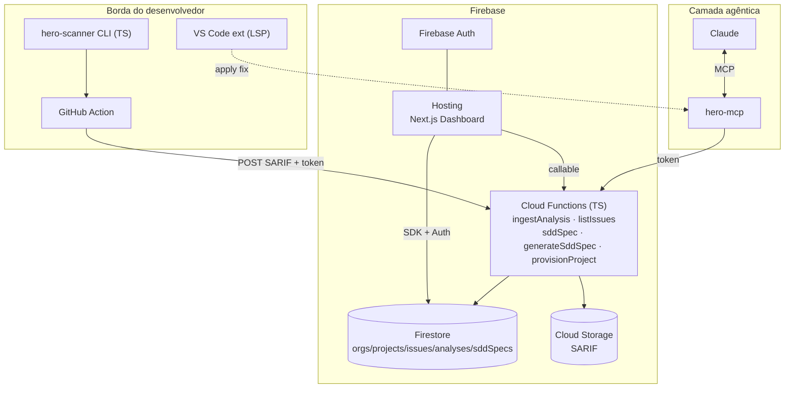
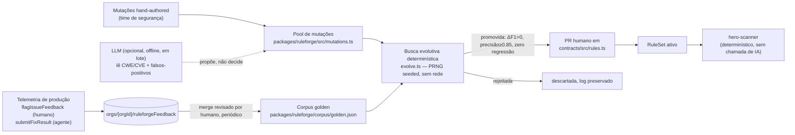

# CodeHero — Arquitetura (SaaS no Firebase)

Adaptação do plano original (Rust/Go/Postgres/ClickHouse) para um **SaaS nativo em Firebase**, mantendo os três módulos e o princípio central: **a IA nunca está no caminho crítico da inspeção**.

## Princípio invariável

- **Inspeção** = determinística, na borda (CLI/CI/IDE), sem chamada de LLM por arquivo.
- **IA** = offline (compila regras — `hero-ruleforge`) e assíncrona/sob demanda (gera specs SDD — `hero-forge`).
- **Contrato** entre os dois mundos = **SARIF-estendido** (detecção) → **SDD Spec** (correção verificável).

## Mapeamento de containers: plano original → Firebase

| Papel | Plano original | **Adaptação Firebase** |
|---|---|---|
| Motor de inspeção | Rust + tree-sitter | **TS/Node** na borda (MVP) → Rust (V1+). Roda em CLI/CI/IDE, nunca no servidor |
| API/Gateway | Go | **Cloud Functions (2ª gen, TS)** — `ingestAnalysis`, `listIssues`, `sddSpec` |
| Workers | Go | Cloud Functions acionadas por HTTP/Firestore triggers |
| SDD/IA | Python/FastAPI | **Callable Function** `generateSddSpec` (+ `hero-forge` opcional em Cloud Run p/ LLM) |
| Dashboard | Next.js | **Next.js no Firebase Hosting** |
| Metadados | PostgreSQL | **Firestore** (`orgs/projects/issues/analyses/sddSpecs`) |
| Séries temporais | ClickHouse | Firestore (MVP) → **BigQuery** export (Scale-up) |
| SARIF/artefatos | S3 | **Cloud Storage** |
| Event bus | NATS/Kafka | **Firestore triggers / Pub/Sub** (Eventarc) |
| Auth/Multi-tenant | custom | **Firebase Auth** + modelo `orgs/{orgId}/members` |
| MCP server | TS | `@codehero/mcp` (stdio), proxy dos endpoints token-guarded |

## Diagrama de containers (Firebase)



## Modelo de dados no Firestore

```
orgs/{orgId}
  ├─ name, ownerUid, createdAt
  ├─ members/{uid}                     → { role: owner|admin|member }
  └─ projects/{projectId}
       ├─ name, repoUrl, mainBranch, ingestToken (secret)
       ├─ debtMinutes, maintainabilityRating, securityRating, qualityGateStatus
       ├─ analyses/{analysisId}        → { branch, commit, summary{bySeverity,debt,gate}, sarifPath }
       ├─ issues/{fingerprint}         → { ruleId, severity, file, line, snippet, status, isNewCode, ... }
       └─ sddSpecs/{specId}            → SDD Spec + createdBy
```

**Segurança:** toda escrita de análise/issue passa por Functions (Admin SDK). As regras do Firestore são *read-mostly*, restritas por `members/{uid}`. O `ingestToken` autentica o CI (bearer). Ver `firestore.rules`.

## Fluxo de correção (loop verificável)

1. `hero-scanner` gera SARIF na borda → `ingestAnalysis` persiste issues + débito + quality gate.
2. Dev/Claude pede correção → `sddSpec`/`generateSddSpec` monta o **SDD Spec** (com `acceptanceCriteria` verificáveis) a partir da issue + template.
3. Claude (via `hero-mcp`) gera `unified_diff`, aplica, roda `run_scan` e checa **AC1** (issue resolvida) objetivamente.
4. Telemetria do fix realimenta o dataset do `hero-ruleforge` (Scale-up).

## Fórmulas (SQALE) — implementadas em `@codehero/contracts/metrics`

- `TechnicalDebt = Σ remediationEffortMin` (code smells)
- `DevelopmentCost = LOC × 30min`
- `TDR = Debt / DevelopmentCost` → Maintainability Rating A–E
- Security/Reliability Rating = pior severidade presente
- Quality Gate sobre **new code** (coverage, duplicação, blockers, ratings)

## Roadmap (Firebase)

| Fase | Entregáveis | Status |
|---|---|---|
| **0 — Fundação** | Monorepo, contratos (SARIF+/SDD/SQALE), Firebase config, regras | ✅ feito |
| **1 — MVP** | Scanner→SARIF, `ingestAnalysis`, débito/quality gate, GitHub Action, dashboard read-only | ✅ scanner+functions+action / 🟡 dashboard |
| **2 — V1** | `generateSddSpec` + `hero-mcp` + loop agêntico, VS Code LSP, ruleforge v0, +linguagens | 🟡 SDD+MCP feitos / ⬜ IDE, ruleforge |
| **3 — Scale-up** | BigQuery, taint inter-procedural (Rust), RBAC/SSO, feedback loop, auto-regras via CVE | ⬜ |

## Dependências críticas

1. **Contratos congelados** (SARIF+/SDD Spec) — feito, base de tudo.
2. **Scanner re-executável programaticamente** (`run_scan`) — feito, habilita a verificação agêntica.
3. **Corpus golden** para validar regras geradas por IA — feito (`packages/ruleforge/corpus/golden.json`), alimenta o `hero-ruleforge`.

## `hero-ruleforge` — como as regras evoluem sem custo de IA generativa por execução

**Restrição de design (não negociável):** a verificação de uma regra candidata é sempre um **algoritmo determinístico** — pontuação de precisão/recall contra o corpus golden, custando microssegundos de CPU. Isso existe especificamente para impedir que "a IA evolui as regras" degenere silenciosamente em "a IA analisa cada arquivo", o que faria o custo de inferência crescer linearmente com o volume de código escaneado. A IA generativa, quando usada, entra apenas como **uma fonte opcional de propostas**, chamada em lote e offline (nunca por arquivo, nunca por scan) — ver `packages/ruleforge/src/llmGenerator.ts`.



**Mecânica implementada** (`packages/ruleforge`):
- **Corpus golden** (`corpus/golden.json`): casos rotulados `match`/`no_match` por regra, incluindo *traps* de falso-positivo e lacunas de falso-negativo reais.
- **Avaliador** (`evaluate.ts`): roda `matchPattern` — o **mesmo** matcher do scanner de produção (`packages/contracts/src/matcher.ts`) — contra o corpus, calcula precisão/recall/F1. Zero chance de uma regra "passar" na validação e se comportar diferente em produção, porque só existe uma implementação de matching.
- **Pool de mutações** (`mutations.ts`): transformações pequenas e revisáveis do regex/`unless`, com autoria humana (MVP) ou proposta por LLM (V1+, interface em `llmGenerator.ts`).
- **Busca evolutiva** (`evolve.ts`): algoritmo genético com PRNG determinístico (seed fixa, reprodutível/auditável) — população inicial inclui a regra-base inalterada; gerações aplicam bit-flip mutation sobre o pool; fitness = F1 com desempate por precisão e por simplicidade (menos mutações ativas).
- **Portão de promoção**: uma candidata só é promovida se (a) melhora o F1 sobre a baseline, (b) mantém precisão ≥ 0.85, e (c) **não regride nenhum caso que a regra atual já acerta** — o guard-rail central contra "consertar uma coisa e quebrar outra".

**Resultado real de uma execução** (`node packages/ruleforge/src/cli.ts evolve-all`, seed=42, 2026-07-26):

| Regra | Baseline F1 | Melhor F1 | Decisão |
|---|---|---|---|
| `HERO-SEC-0798-hardcoded-secret` | 0.50 | **1.00** | ✅ PROMOTED (2 mutações mescladas em `rules.ts`) |
| `HERO-SEC-0327-weak-hash` | 0.67 | **1.00** | ✅ PROMOTED (1 mutação mesclada em `rules.ts`) |
| `HERO-SEC-0089-sql-injection` | 0.67 | 0.67 | ❌ REJECTED — mutação proposta (f-strings) não cobria o gap real (template literals JS); nenhum ganho, nada promovido |
| `HERO-SEC-0095-code-injection-eval` | 1.00 | 1.00 | ❌ REJECTED — já ótima, sem espaço de melhoria |

O caso da `sql-injection` é a demonstração mais importante do portão de segurança: uma mutação foi *proposta* mas **rejeitada automaticamente** por não gerar ganho real — nem toda proposta (humana ou de IA) vira regra. Isso vale tanto para mutações mal-direcionadas quanto para eventuais alucinações de um gerador via LLM.

**Loop de telemetria em produção** (`apps/functions/src/feedback.ts`):
- `flagIssueFeedback` (callable, autenticado) — humano marca uma issue como falso-positivo ou confirma-a no dashboard.
- `submitFixResult` (HTTP, token de projeto) — o agente (via `hero-mcp`) reporta se um fix aplicado a partir de um SDD Spec foi aceito/rejeitado/falhou; alimenta a taxa de sucesso por `sddTemplateId` (métrica de qualidade do SDD), não o corpus de regras diretamente — evita rotular ambiguamente ("fix rejeitado" não implica "detecção era falsa").
- Verdicts inequívocos (`false_positive`/`confirmed`) são gravados em `orgs/{orgId}/ruleforgeFeedback`, material bruto que um job em lote (Cloud Scheduler → Cloud Run, revisão humana via PR) mescla periodicamente no corpus golden — fechando o ciclo "aprende com o uso real" sem nunca introduzir uma chamada de IA generativa no caminho de verificação.
