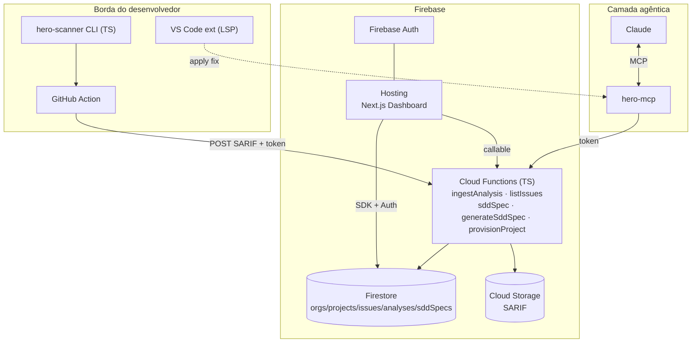
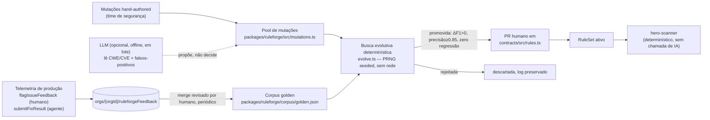

# CodeHero — Arquitetura (SaaS no Firebase)

Adaptação do plano original (Rust/Go/Postgres/ClickHouse) para um **SaaS nativo em Firebase**, mantendo os três módulos e o princípio central: **a IA nunca está no caminho crítico da inspeção**.

## Princípio invariável

- **Inspeção** = determinística, na borda (CLI/CI/IDE), sem chamada de LLM por arquivo.
- **IA** = offline (compila regras — `hero-ruleforge`) e assíncrona/sob demanda (gera specs SDD — `hero-forge`).
- **Contrato** entre os dois mundos = **SARIF-estendido** (detecção) → **SDD Spec** (correção verificável).

## Mapeamento de containers: plano original → Firebase

| Papel | Plano original | **Adaptação Firebase** |
|---|---|---|
| Motor de inspeção | Rust + tree-sitter | **TS/Node** na borda (MVP) → Rust (V1+). Roda em CLI/CI/IDE, nunca no servidor |
| API/Gateway | Go | **Cloud Functions (2ª gen, TS)** — `ingestAnalysis`, `listIssues`, `sddSpec` |
| Workers | Go | Cloud Functions acionadas por HTTP/Firestore triggers |
| SDD/IA | Python/FastAPI | **Callable Function** `generateSddSpec` (+ `hero-forge` opcional em Cloud Run p/ LLM) |
| Dashboard | Next.js | **Next.js no Firebase Hosting** |
| Metadados | PostgreSQL | **Firestore** (`orgs/projects/issues/analyses/sddSpecs`) |
| Séries temporais | ClickHouse | Firestore (MVP) → **BigQuery** export (Scale-up) |
| SARIF/artefatos | S3 | **Cloud Storage** |
| Event bus | NATS/Kafka | **Firestore triggers / Pub/Sub** (Eventarc) |
| Auth/Multi-tenant | custom | **Firebase Auth** + modelo `orgs/{orgId}/members` |
| MCP server | TS | `@codehero/mcp` (stdio), proxy dos endpoints token-guarded |

## Diagrama de containers (Firebase)



## Modelo de dados no Firestore

```
orgs/{orgId}
  ├─ name, ownerUid, createdAt
  ├─ members/{uid}                     → { role: owner|admin|member }
  └─ projects/{projectId}
       ├─ name, repoUrl, mainBranch, ingestToken (secret)
       ├─ debtMinutes, maintainabilityRating, securityRating, qualityGateStatus
       ├─ analyses/{analysisId}        → { branch, commit, summary{bySeverity,debt,gate}, sarifPath }
       ├─ issues/{fingerprint}         → { ruleId, severity, file, line, snippet, status, isNewCode, ... }
       └─ sddSpecs/{specId}            → SDD Spec + createdBy
```

**Segurança:** toda escrita de análise/issue passa por Functions (Admin SDK). As regras do Firestore são *read-mostly*, restritas por `members/{uid}`. O `ingestToken` autentica o CI (bearer). Ver `firestore.rules`.

## Fluxo de correção (loop verificável)

1. `hero-scanner` gera SARIF na borda → `ingestAnalysis` persiste issues + débito + quality gate.
2. Dev/Claude pede correção → `sddSpec`/`generateSddSpec` monta o **SDD Spec** (com `acceptanceCriteria` verificáveis) a partir da issue + template.
3. Claude (via `hero-mcp`) gera `unified_diff`, aplica, roda `run_scan` e checa **AC1** (issue resolvida) objetivamente.
4. Telemetria do fix realimenta o dataset do `hero-ruleforge` (Scale-up).

## Fórmulas (SQALE) — implementadas em `@codehero/contracts/metrics`

- `TechnicalDebt = Σ remediationEffortMin` (code smells)
- `DevelopmentCost = LOC × 30min`
- `TDR = Debt / DevelopmentCost` → Maintainability Rating A–E
- Security/Reliability Rating = pior severidade presente
- Quality Gate sobre **new code** (coverage, duplicação, blockers, ratings)

## Roadmap (Firebase)

| Fase | Entregáveis | Status |
|---|---|---|
| **0 — Fundação** | Monorepo, contratos (SARIF+/SDD/SQALE), Firebase config, regras | ✅ feito |
| **1 — MVP** | Scanner→SARIF, `ingestAnalysis`, débito/quality gate, GitHub Action, dashboard read-only | ✅ scanner+functions+action / 🟡 dashboard |
| **2 — V1** | `generateSddSpec` + `hero-mcp` + loop agêntico, VS Code LSP, ruleforge v0, +linguagens | 🟡 SDD+MCP feitos / ⬜ IDE, ruleforge |
| **3 — Scale-up** | BigQuery, taint inter-procedural (Rust), RBAC/SSO, feedback loop, auto-regras via CVE | ⬜ |

## Dependências críticas

1. **Contratos congelados** (SARIF+/SDD Spec) — feito, base de tudo.
2. **Scanner re-executável programaticamente** (`run_scan`) — feito, habilita a verificação agêntica.
3. **Corpus golden** para validar regras geradas por IA — feito (`packages/ruleforge/corpus/golden.json`), alimenta o `hero-ruleforge`.

## `hero-ruleforge` — como as regras evoluem sem custo de IA generativa por execução

**Restrição de design (não negociável):** a verificação de uma regra candidata é sempre um **algoritmo determinístico** — pontuação de precisão/recall contra o corpus golden, custando microssegundos de CPU. Isso existe especificamente para impedir que "a IA evolui as regras" degenere silenciosamente em "a IA analisa cada arquivo", o que faria o custo de inferência crescer linearmente com o volume de código escaneado. A IA generativa, quando usada, entra apenas como **uma fonte opcional de propostas**, chamada em lote e offline (nunca por arquivo, nunca por scan) — ver `packages/ruleforge/src/llmGenerator.ts`.



**Mecânica implementada** (`packages/ruleforge`):
- **Corpus golden** (`corpus/golden.json`): casos rotulados `match`/`no_match` por regra, incluindo *traps* de falso-positivo e lacunas de falso-negativo reais.
- **Avaliador** (`evaluate.ts`): roda `matchPattern` — o **mesmo** matcher do scanner de produção (`packages/contracts/src/matcher.ts`) — contra o corpus, calcula precisão/recall/F1. Zero chance de uma regra "passar" na validação e se comportar diferente em produção, porque só existe uma implementação de matching.
- **Pool de mutações** (`mutations.ts`): transformações pequenas e revisáveis do regex/`unless`, com autoria humana (MVP) ou proposta por LLM (V1+, interface em `llmGenerator.ts`).
- **Busca evolutiva** (`evolve.ts`): algoritmo genético com PRNG determinístico (seed fixa, reprodutível/auditável) — população inicial inclui a regra-base inalterada; gerações aplicam bit-flip mutation sobre o pool; fitness = F1 com desempate por precisão e por simplicidade (menos mutações ativas).
- **Portão de promoção**: uma candidata só é promovida se (a) melhora o F1 sobre a baseline, (b) mantém precisão ≥ 0.85, e (c) **não regride nenhum caso que a regra atual já acerta** — o guard-rail central contra "consertar uma coisa e quebrar outra".

**Resultado real de uma execução** (`node packages/ruleforge/src/cli.ts evolve-all`, seed=42, 2026-07-26):

| Regra | Baseline F1 | Melhor F1 | Decisão |
|---|---|---|---|
| `HERO-SEC-0798-hardcoded-secret` | 0.50 | **1.00** | ✅ PROMOTED (2 mutações mescladas em `rules.ts`) |
| `HERO-SEC-0327-weak-hash` | 0.67 | **1.00** | ✅ PROMOTED (1 mutação mesclada em `rules.ts`) |
| `HERO-SEC-0089-sql-injection` | 0.67 | 0.67 | ❌ REJECTED — mutação proposta (f-strings) não cobria o gap real (template literals JS); nenhum ganho, nada promovido |
| `HERO-SEC-0095-code-injection-eval` | 1.00 | 1.00 | ❌ REJECTED — já ótima, sem espaço de melhoria |

O caso da `sql-injection` é a demonstração mais importante do portão de segurança: uma mutação foi *proposta* mas **rejeitada automaticamente** por não gerar ganho real — nem toda proposta (humana ou de IA) vira regra. Isso vale tanto para mutações mal-direcionadas quanto para eventuais alucinações de um gerador via LLM.

**Loop de telemetria em produção** (`apps/functions/src/feedback.ts`):
- `flagIssueFeedback` (callable, autenticado) — humano marca uma issue como falso-positivo ou confirma-a no dashboard.
- `submitFixResult` (HTTP, token de projeto) — o agente (via `hero-mcp`) reporta se um fix aplicado a partir de um SDD Spec foi aceito/rejeitado/falhou; alimenta a taxa de sucesso por `sddTemplateId` (métrica de qualidade do SDD), não o corpus de regras diretamente — evita rotular ambiguamente ("fix rejeitado" não implica "detecção era falsa").
- Verdicts inequívocos (`false_positive`/`confirmed`) são gravados em `orgs/{orgId}/ruleforgeFeedback`, material bruto que um job em lote (Cloud Scheduler → Cloud Run, revisão humana via PR) mescla periodicamente no corpus golden — fechando o ciclo "aprende com o uso real" sem nunca introduzir uma chamada de IA generativa no caminho de verificação.

## Multi-linguagem (SQL Server, DB2, Python, Node, C#, VB.Net, Java, COBOL)

`RuleLanguage` (`packages/contracts/src/rules.ts`) cobre hoje: `python`, `javascript`, `typescript`, `java`, `go`, `csharp`, `vbnet`, `cobol`, `tsql`, `db2sql`. Regras genéricas com `languages: ["any"]` (segredo hardcoded, TODO marker) já se aplicam a todas automaticamente; linguagens com sintaxe estruturalmente diferente exigem regra própria — comprovado ao vivo:

| Linguagem | Regra dedicada | Motivo de precisar de padrão próprio |
|---|---|---|
| T-SQL / DB2 | `HERO-SEC-0089-dynamic-sql-tsql` | Dynamic SQL via `SET @sql = ... + ...` / `EXEC(...)`, não uma chamada `execute()` como em Python/JS |
| C# / VB.Net | `HERO-SEC-0089-adonet-sqli` | `new SqlCommand(...)` (ADO.NET), sintaxe de instanciação de objeto, não uma chamada de função direta |
| COBOL | `HERO-SEC-0798-cobol-hardcoded-secret` | Atribuição é `MOVE 'valor' TO campo`, não `campo = 'valor'`; identificadores usam hífen (`WS-DB-PASSWORD`) |
| COBOL | `HERO-SMELL-0goto-cobol` | `GO TO` (fluxo não estruturado) é um code smell específico do paradigma procedural COBOL, sem equivalente nas linguagens anteriores |

Todas as 4 regras novas têm casos no corpus golden com F1 = 1.00 (`node packages/ruleforge/src/cli.ts evaluate`), incluindo os *traps* de falso-positivo (query parametrizada em C#/T-SQL, `GO TO.` idiomático de fim-de-parágrafo em COBOL).

**Risco conhecido, não resolvido nesta iteração:** o matcher MVP (regex por linha) não faz taint/dataflow entre linhas — por isso a regra T-SQL mira a linha de concatenação (`SET @sql = ...`), não a linha de execução (`EXEC(@sql)`), que ficam fisicamente separadas no código real. Isso é suficiente para o MVP mas é exatamente a limitação que a análise de dataflow inter-procedural (Fase 3, motor Rust) resolve de vez.

## Escala: 100 mil repositórios, 2 bilhões de linhas de código

Este requisito muda o eixo de risco do MVP: já não basta "funcionar", precisa **não degradar linearmente** com volume. Três frentes distintas, cada uma com uma resposta diferente:

**1. Execução do scan em si — já resolvida por construção.** O princípio "a IA/motor nunca roda centralizado" (Seção 1) significa que os 2 bilhões de linhas nunca chegam a um único processo: cada um dos 100 mil repositórios roda seu próprio `hero-scanner` no runner de CI **daquele** repositório (GitHub Actions, self-hosted, etc.), em paralelo, pago e escalado pela infraestrutura de CI do próprio cliente — não pela CodeHero. Isso é o oposto de um SaaS que baixa/clona repositórios para escanear centralmente (o que exigiria uma frota própria de workers dimensionada para o pior caso). O backend só recebe o **resultado agregado** (SARIF), não o código-fonte bruto.

**2. Ingestão do resultado — corrigido nesta iteração.** `ingestAnalysis` usava um único `WriteBatch` do Firestore, que tem um teto rígido de 500 operações — um monólito COBOL/Java grande facilmente ultrapassa isso e o batch falharia silenciosamente em produção sob carga real. Trocado por `BulkWriter` (`apps/functions/src/ingest.ts`), que faz paginação e retry automáticos e é o caminho recomendado do Admin SDK para volume alto. As métricas agregadas (débito, ratings, quality gate) já eram calculadas e gravadas de forma denormalizada no documento do projeto — o dashboard nunca precisa varrer todas as issues para montar uma visão de tendência, o que seria proibitivo em escala.

**3. Precisão e eficiência do algoritmo de match em si — é aqui que o roadmap V1→Scale-up (Seção "Roadmap", Fase 3) se torna obrigatório, não opcional:**
   - **Análise incremental por hash de conteúdo**: reprocessar 2 bilhões de linhas a cada scan é inviável; a maioria dos scans em repositórios grandes é incremental (só o diff mudou). O scanner deve cachear resultados por hash de arquivo e pular arquivos inalterados — item de engenharia concreto para a Fase 1→2, ainda não implementado neste passe.
   - **Motor nativo (Rust/tree-sitter)**: o matcher MVP é regex-por-linha em Node — adequado para provar o modelo, não para 2B LOC com precisão alta. A migração para tree-sitter (Seção 3 original) é o que sustenta paralelismo real (sem GIL/event-loop) e parsing de AST de verdade (elimina a classe inteira de falso-positivo/negativo que um regex comete, como o gap do `sql-injection` em JS documentado acima).
   - **Risco de maturidade de gramática por linguagem**: tree-sitter tem gramáticas maduras para C#, Java, SQL genérico. **COBOL e VB.Net têm gramáticas tree-sitter comunitárias, menos maduras e com cobertura parcial de dialetos** (COBOL tem múltiplos dialetos de compilador — IBM Enterprise COBOL, Micro Focus, GnuCOBOL — com extensões de sintaxe divergentes). Isso é um risco real de roadmap, não um detalhe: pode exigir um parser dedicado (ou um parser combinator hand-rolled para o subset relevante) em vez de depender de tree-sitter pronto, especialmente para o embedded SQL (`EXEC SQL ... END-EXEC`) que mistura duas gramáticas no mesmo arquivo.
   - **Nada disso foi provisionado nesta iteração** — não foi criada nenhuma infraestrutura de computação distribuída (GKE, Cloud Run em escala, filas) real, porque isso tem custo e implicações operacionais que exigem aprovação explícita antes de provisionar. O que existe hoje (scanner em Node, ingestão via Functions) prova o modelo correto; a escala de 2B LOC exige a Fase 3 do roadmap como pré-requisito, não uma otimização incremental do MVP.

## Configuração real de Firebase (projeto compartilhado `apponti`)

Este projeto foi configurado para reusar o **mesmo projeto Firebase/GCP** de outras aplicações do usuário (ex.: myabba.com.br), seguindo o padrão já em produção: um projeto GCP hospeda múltiplos apps como **Hosting sites distintos**, com Cloud Functions com nomes não-colidentes, e **um único banco Firestore compartilhado** por projeto.

- `.firebaserc` → `"default": "apponti"`.
- `firebase.json` → `hosting.site = "codehero"` (site novo, distinto de `mypeace`/`apponti`/`api-apponti` já existentes no projeto).
- `.github/workflows/firebase-deploy.yml` → deploy restrito a `hosting:codehero` + as functions do CodeHero, nomeadas explicitamente.

**⚠️ Duas ações pendentes que exigem autorização/acesso do usuário, não executadas por mim:**

1. **Criar o Hosting site `codehero`** no projeto `apponti` antes do primeiro deploy: `firebase hosting:sites:create codehero --project apponti` (ou via Console). Sem isso, o workflow de deploy falha na primeira execução.
2. **Mesclar `firestore.rules` deste repositório** nas regras canônicas do projeto compartilhado. Firestore tem **um único ruleset por banco** — um `firebase deploy --only firestore:rules --project apponti` a partir deste repositório **substituiria por inteiro** as regras de produção do app já existente (myabba.com.br), inclusive as dele. Por isso o workflow de deploy do CodeHero **propositalmente não inclui** `firestore:rules`/`storage`/`firestore:indexes` no `--only`. Os blocos `match /orgs/{orgId}/...` deste `firestore.rules` precisam ser copiados manualmente para o arquivo de regras que já governa o projeto `apponti` em produção (provavelmente mantido no repositório do myabba/Jesus ou do Apponti) — uma revisão humana é apropriada aqui dado que é uma alteração de segurança em um app já em produção com usuários reais.
