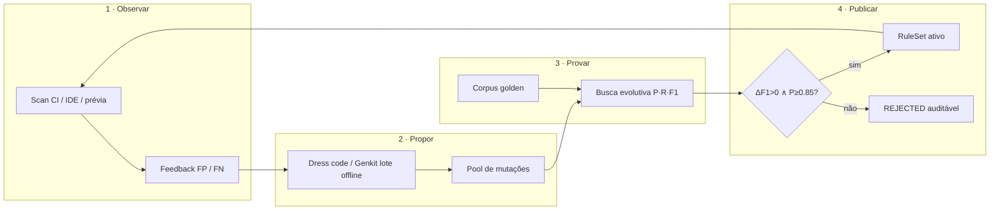
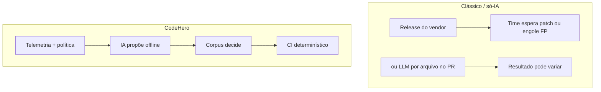

# Esteira de aprendizado de regras (Ruleforge)

> Página da wiki do CodeHero — espelho em `docs/wiki/` no repositório.
> Docs interativas: https://codehero.web.app/docs/#aprendizado-continuo

## Em uma frase

A IA **propõe** mutações de regra offline; o **corpus golden + F1** **decidem** o que entra no CI. O scanner do PR permanece determinístico.

## Passo a passo



| Passo | O que acontece | O que **não** acontece |
|---|---|---|
| **1. Observar** | Findings + flags FP/FN + resultados de correção viram telemetria | LLM não lê o diff do PR para “inventar” regra na hora |
| **2. Propor** | Genkit / dress code / curadoria humana alimentam o pool (`ruleforgeDaily`) | Proposta não publica sozinha no RuleSet |
| **3. Provar** | `@codehero/ruleforge` mede P, R, F1 no corpus (`evolve.ts`) | Não há “confiança” subjetiva do modelo |
| **4. Publicar** | Só com ΔF1&gt;0, P≥0,85 e zero regressão | Sem republicar plugin / Action |

## Como isso difere das demais ferramentas



| Critério | CodeHero | Suite enterprise | Scanner só de IA |
|---|---|---|---|
| Quem decide a regra | Corpus + F1 | Vendor | Modelo / prompt |
| LLM no arquivo do PR? | Não | Em geral não | Sim |
| Mesmo commit → mesmo resultado | Sim | Sim | Não garantido |
| Política do time em linguagem natural | Dress code → regra | Raro | Não estruturado |

## Cenário exercitado (run real)

Comandos:

```bash
npm run ruleforge:evaluate
npm run ruleforge:evolve-all
```

**O que medimos**

- 20 regras no corpus golden (ex.: `HERO-SEC-0798-hardcoded-secret`, `HERO-SEC-0089-sql-injection`) com **P = R = F1 = 1,00**.

**O que o evolve fez**

1. Baseline F1 = 1,000.
2. 5 gerações de busca evolutiva com seed reproduzível.
3. Melhor candidato também F1 = 1,000.

**Decisão**

```
DECISÃO: REJECTED — sem ganho de F1 (baseline=1.000, melhor=1.000)
```

ou, quando não há mutações cadastradas para a regra:

```
DECISÃO: REJECTED — sem mutações registradas para esta regra
```

**Leitura de produto:** o portão funcionou. Regras já perfeitas no corpus **não** são “melhoradas” por cosmética. Promoção só existe com **ganho comprovado**.

### Cenário de promoção (fluxo de produto)

1. Dev marca FP: `console.log` em arquivo de teste.
2. Admin publica dress code: “proibido `console.log` em produção”.
3. Genkit propõe regra + casos entram no corpus.
4. Se ΔF1&gt;0 e P≥0,85 → proposta na fila → RuleSet.
5. Próximo PR: scanner determinístico aplica a regra — sem LLM no hot path.

## CLI útil

| Comando | Função |
|---|---|
| `npm run ruleforge:evaluate` | Tabela P/R/F1 por regra |
| `npm run ruleforge:evolve-all` | Busca evolutiva em lote |
| Cloud Function `ruleforgeDaily` | Genkit 1×/dia (requer `GEMINI_API_KEY`) |

## Links

- Docs: [/docs/#aprendizado-continuo](https://codehero.web.app/docs/#aprendizado-continuo)
- Landing: seção “A esteira que aprende regras”
- Código: `packages/ruleforge/`, `apps/functions/src/ruleforgeDaily.ts`
