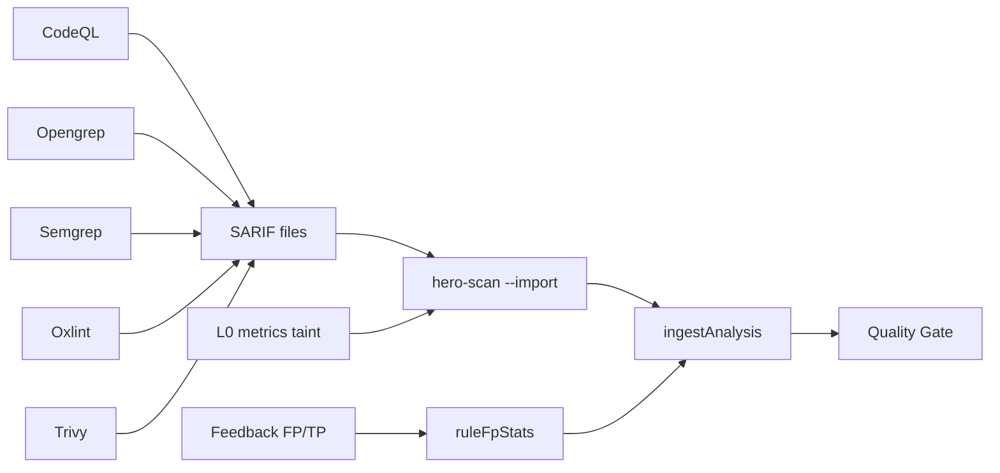

# Pack Presença SARIF — matriz oficial

Como o CodeHero **aumenta presença vs Sonar** sem reinventar motores: roda ferramentas especializadas, importa SARIF com provenance `EXT:<tool>:<rule>`, e o Quality Gate decide.

Princípio: LLM **nunca** no hot path do PR. Modelos só offline (ruleforge / fp-ranker / triage batch).

## Matriz tool → comando → import

| Tool | Comando típico | Artefato | Action / scanner |
|---|---|---|---|
| **CodeQL** | `codeql database analyze … --format=sarif-latest -o codeql.sarif` | `codeql.sarif` | `import-sarif` ou job prévio |
| **Opengrep** | `opengrep scan --config auto --sarif -o opengrep.sarif` | `opengrep.sarif` | input `opengrep: true` ou `--with-opengrep` |
| **Semgrep** | `semgrep scan --config auto --sarif -o semgrep.sarif` | `semgrep.sarif` | input `semgrep: true` ou `--with-semgrep` |
| **Oxlint** | `npx oxlint . -f sarif -o oxlint.sarif` | `oxlint.sarif` | input `oxlint: true` ou `--with-oxlint` |
| **Trivy** (SCA) | `trivy fs --format sarif -o trivy.sarif .` | `trivy.sarif` | input `sca: true` / `--with-sca` |
| **osv-scanner** | `osv-scanner --format sarif -o osv.sarif .` | `osv.sarif` | `sca-tool: osv` |
| **Joern** | via `--joern` | embutido | input `joern: true` |

Todos os achados importados usam id `EXT:<ferramenta>:<regra>` ([`importSarif.ts`](../../packages/scanner/src/importSarif.ts)).

## Fluxo CI recomendado

## Aprendizado no gate (FP local)

Quando uma regra acumula no **mesmo repo** ≥5 feedbacks e taxa FP ≥60%, os achados dessa regra:

- Continuam visíveis no portal (`fora do gate (FP local)`)
- **Não** contam para blockers novos / ratings do Quality Gate

Stats em `repos/{repoId}/ruleFpStats`. O fp-ranker também usa `ruleRepoFpRate` + `toolDepth` (CodeQL > Opengrep/Semgrep > Oxlint).

## Checklist de adoção

1. Portal → token + org/project/repo na Action.
2. Ligue `metrics: true` (já default), `opengrep` e/ou `oxlint`/`semgrep`/`sca` conforme stack.
3. CodeQL: job nightly → passe o SARIF em `import-sarif`.
4. Confirme no portal provenance `via codeql` / `via opengrep` / etc.
5. Marque FP/TP nos findings — após N≥5 a regra ruidosa sai do gate sozinha.
6. Não habilite Joern no default sem JDK/Docker consciente.

## Models (Fase 4 — offline)

| Modelo | Uso |
|---|---|
| Orquestração de agentes | Dress code + mutações ruleforge (portão F1) |
| fp-ranker | Treino com `exportRuleforgeFeedback` → `hero-fp-ranker train` |
| LLM local / triagem em lote | `scripts/foundation-sec-triage.mjs` em batch — **não** no gate |

Docs produto: [/docs/#presenca-sarif](https://codehero.web.app/docs/#presenca-sarif)

## Exemplo de workflow

Ver [`examples/github-workflows/codehero-presence.example.yml`](../../examples/github-workflows/codehero-presence.example.yml).
