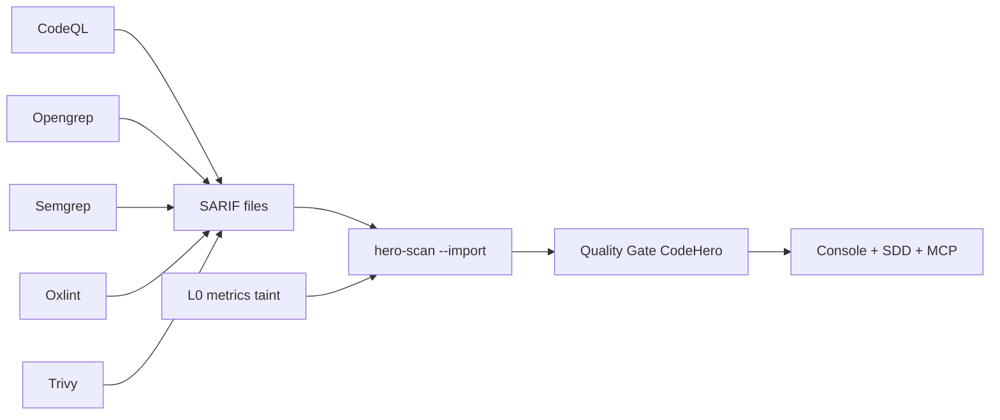

# Presence Pack — um juiz, vários sensores

**Para o líder técnico:** você não precisa trocar CodeQL, Semgrep ou Trivy. Precisa de **uma política de gate** e um loop de correção. O Presence Pack importa SARIF desses motores com provenance `EXT:<tool>:<rule>` e o Quality Gate do CodeHero decide.

Isso sustenta a tese comercial: motor nativo **peer-competitive em segurança** ([Posicionamento](./Posicionamento-e-metricas.md)); amplitude de smells/SAST enterprise entra por **orquestração**, não por promessa de catálogo nativo equivalente.

**Princípio de risco:** LLM **nunca** no hot path do PR. Modelos só offline (ruleforge / fp-ranker / triage).

## Matriz tool → comando → import

| Tool | Comando típico | Artefato | Action / scanner |
|---|---|---|---|
| **CodeQL** | `codeql database analyze … --format=sarif-latest -o codeql.sarif` | `codeql.sarif` | `import-sarif` ou job prévio |
| **Opengrep** | `opengrep scan --config auto --sarif -o opengrep.sarif` | `opengrep.sarif` | `opengrep: true` / `--with-opengrep` |
| **Semgrep** | `semgrep scan --config auto --sarif -o semgrep.sarif` | `semgrep.sarif` | `semgrep: true` / `--with-semgrep` |
| **Oxlint** | `npx oxlint . -f sarif -o oxlint.sarif` | `oxlint.sarif` | `oxlint: true` / `--with-oxlint` |
| **Trivy** (SCA) | `trivy fs --format sarif -o trivy.sarif .` | `trivy.sarif` | `sca: true` / `--with-sca` |
| **osv-scanner** | `osv-scanner --format sarif -o osv.sarif .` | `osv.sarif` | `sca-tool: osv` |
| **Gitleaks** (secrets) | `gitleaks detect --report-format sarif -o gitleaks.sarif` | `gitleaks.sarif` | `secrets: true` / `--with-secrets` / `profile: presence` |
| **Joern** | via `--joern` | embutido | `joern: true` |
| **ESLint** | `eslint -f json` | convertido | `eslint: true` |
| **PMD** | `pmd check -f sarif` | SARIF | `pmd: true` / `profile: java` |
| **SpotBugs** | `spotbugs -sarif` | SARIF | `spotbugs: true` + classes |

## Perfis (mesmo intent em CLI, Action, MCP, IDE)

| Perfil | Engines | Quando o TL escolhe |
|---|---|---|
| `native` | Só CodeHero | Gate rápido + legado + agentes |
| `presence` | metrics + oxlint + opengrep + sca + secrets | Amplitude + SCA + secrets sem JVM |
| `java` | metrics + pmd + spotbugs | Stack Java no mesmo juiz |
| `full` | adapters (exceto Joern) | Máxima presença no PR noturno / scheduled |

Flags individuais fazem **OR** por cima do perfil.

## Cobertura e complexidade (linguagem de risco)

CodeHero **não** instrumenta bytecode (igual Sonar). Consome JaCoCo / JCov / Cobertura e cruza com ciclomática (`--metrics` + `--coverage`): duas suítes com 70% de linha podem ter risco oposto — o cruzamento **complexidade coberta vs não coberta** deixa isso visível no SARIF e no portal.

Gate: `minNewCodeCoverage` + opcional `minBranchCoverage` (só quando há dados de branch).

## Leitura assistida (orçamento, não “IA no PR”)

`--llm-budget` só recorta trechos do diff onde o determinístico **não** apontou. Observação de modelo **nunca** entra no gate — vira candidata a regra → corpus → promoção.

## Grafo e CPG

| Camada | Para o líder |
|---|---|
| **code-graph** nativo | Priorização e SDD — determinístico ([Code-graph](./Code-graph-deterministico.md)) |
| **Joern** (`--joern`) | CPG profundo opcional no mesmo SARIF+ |
| LLM | Só offline |

Achados importados: `EXT:<ferramenta>:<regra>`. Eco na mesma linha colapsa; `alsoRuleIds` no portal/IDE.

## Fluxo CI recomendado

Exemplo: [`examples/github-workflows/codehero-presence.example.yml`](../../examples/github-workflows/codehero-presence.example.yml) · Docs: https://codehero.web.app/docs/#presenca-sarif
