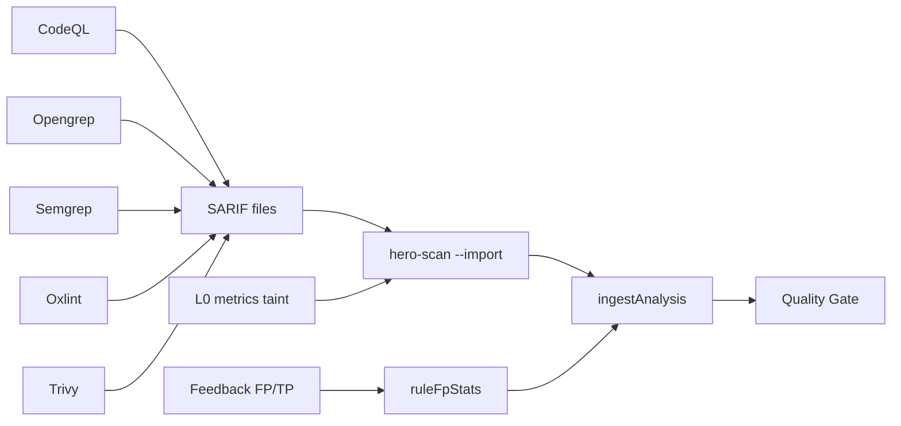

# Pack Presença SARIF — matriz oficial

Como o CodeHero **aumenta presença vs Sonar** sem reinventar motores: roda ferramentas especializadas, importa SARIF com provenance `EXT:<tool>:<rule>`, e o Quality Gate decide.

Princípio: LLM **nunca** no hot path do PR. Modelos só offline (ruleforge / fp-ranker / triage batch).

## Matriz tool → comando → import

| Tool | Comando típico | Artefato | Action / scanner |
|---|---|---|---|
| **CodeQL** | `codeql database analyze … --format=sarif-latest -o codeql.sarif` | `codeql.sarif` | `import-sarif` ou job prévio |
| **Opengrep** | `opengrep scan --config auto --sarif -o opengrep.sarif` | `opengrep.sarif` | input `opengrep: true` ou `--with-opengrep` |
| **Semgrep** | `semgrep scan --config auto --sarif -o semgrep.sarif` | `semgrep.sarif` | input `semgrep: true` ou `--with-semgrep` |
| **Oxlint** | `npx oxlint . -f sarif -o oxlint.sarif` | `oxlint.sarif` | input `oxlint: true` ou `--with-oxlint` |
| **Trivy** (SCA) | `trivy fs --format sarif -o trivy.sarif .` | `trivy.sarif` | input `sca: true` / `--with-sca` |
| **osv-scanner** | `osv-scanner --format sarif -o osv.sarif .` | `osv.sarif` | `sca-tool: osv` |
| **Joern** | via `--joern` | embutido | input `joern: true` |
| **ESLint** | `eslint -f json` | convertido | `eslint: true` / `--with-eslint` |
| **PMD** | `pmd check -f sarif` | SARIF | `pmd: true` / `--with-pmd` / `profile: java` |
| **SpotBugs** | `spotbugs -sarif` | SARIF | `spotbugs: true` + `spotbugs-classes` |

## Perfis canônicos (`--profile` / Action `profile` / MCP / IDE)

| Perfil | Engines |
|---|---|
| `native` | Só CodeHero (default IDE / save) |
| `presence` | metrics + oxlint + opengrep + sca |
| `java` | metrics + pmd + spotbugs |
| `full` | todas as adapters (exceto Joern) |

Mesmo JSON de intent em CLI, GitHub Action, MCP (`run_scan`) e IDE (`codehero.scanProfile`). Flags individuais **OR** por cima do perfil.

## Cobertura: JaCoCo, JCov e branch

O CodeHero **não instrumenta** bytecode — isso é decisão de produto, igual Sonar. O que muda com JaCoCo/JCov/OpenCppCoverage:

- **JaCoCo XML** (`<sourcefile>` + `<line ci mi cb mb>`): linha + branch, já consumido.
- **JCov XML** (`<class source="…">…<bl s e c>`): método/bloco → linha (parser `parseJcov`).
- **OpenCppCoverage**: não tem formato próprio — exporta **Cobertura XML**, então o mesmo `parseCobertura` cobre C++ no Windows.
- **Gate**: `minNewCodeCoverage` (linha, em código novo) + opcional `minBranchCoverage` (% branch global). Branch só aplica quando o relatório tem dados — nunca reprova projeto sem branch instrumentada.

## Leitura assistida por modelo barato (Alibaba OCR)

`--llm-budget <tokens>` ativa o recorte **antes** de qualquer modelo existir: só o trecho do diff onde o determinístico não teve nada a dizer. Três propriedades que mantêm o custo baixo e o gate reproduzível:

1. **Orçamento corta ANTES** de despachar (`tetoDeTokens`), nunca depois.
2. **Linha já coberta por regra não vai para o modelo** — pagar duas vezes pela mesma informação é o que quebra a conta.
3. **Observação nunca entra no gate.** O caminho é candidata a regra → avaliação determinística no corpus → só então vira apontamento reproduzível para todo mundo.

## Symbolic / graph (Better CRG, arXiv 2507.18476)

O eixo "grafo + raciocínio simbólico" já existe em três camadas: **determinístico** (L0 + tree-sitter + AST/taint = o mapa de conhecimento verificável), **grafo** (`--joern` CPG = a busca semântica/call-graph que os CRG MCPs vendem) e **LLM offline** (ruleforge / fp-ranker). Regra: LLM nunca no gate; call-graph entra via `--joern` no mesmo SARIF+.

Todos os achados importados usam id `EXT:<ferramenta>:<regra>` ([`importSarif.ts`](../../packages/scanner/src/importSarif.ts)). Eco entre ferramentas colapsa na mesma linha; ids absorvidos ficam em `alsoRuleIds` (portal/MCP/IDE mostram “também …”).

## Fluxo CI recomendado

## Aprendizado no gate (FP local)

Quando uma regra acumula no **mesmo repo** ≥5 feedbacks e taxa FP ≥60%, os achados dessa regra:

- Continuam visíveis no portal (`fora do gate (FP local)`)
- **Não** contam para blockers novos / ratings do Quality Gate

Stats em `repos/{repoId}/ruleFpStats`. O fp-ranker também usa `ruleRepoFpRate` + `toolDepth` (CodeQL > Opengrep/Semgrep > Oxlint).

## Checklist de adoção

1. Portal → token + org/project/repo na Action.
2. Ligue `metrics: true` (já default), `opengrep` e/ou `oxlint`/`semgrep`/`sca` conforme stack.
3. CodeQL: job nightly → passe o SARIF em `import-sarif`.
4. Confirme no portal provenance `via codeql` / `via opengrep` / etc.
5. Marque FP/TP nos findings — após N≥5 a regra ruidosa sai do gate sozinha.
6. Não habilite Joern no default sem JDK/Docker consciente.

## Models (Fase 4 — offline)

| Modelo | Uso |
|---|---|
| Orquestração de agentes | Dress code + mutações ruleforge (portão F1) |
| fp-ranker | Treino com `exportRuleforgeFeedback` → `hero-fp-ranker train` |
| LLM local / triagem em lote | `scripts/foundation-sec-triage.mjs` em batch — **não** no gate |

Docs produto: [/docs/#presenca-sarif](https://codehero.web.app/docs/#presenca-sarif)

## Exemplo de workflow

Ver [`examples/github-workflows/codehero-presence.example.yml`](../../examples/github-workflows/codehero-presence.example.yml).
